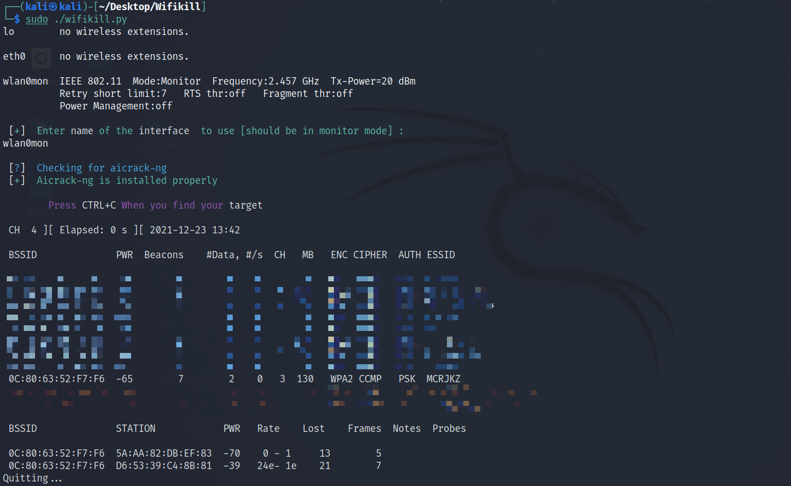
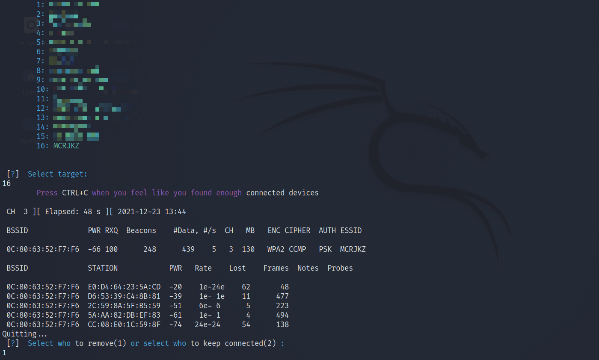
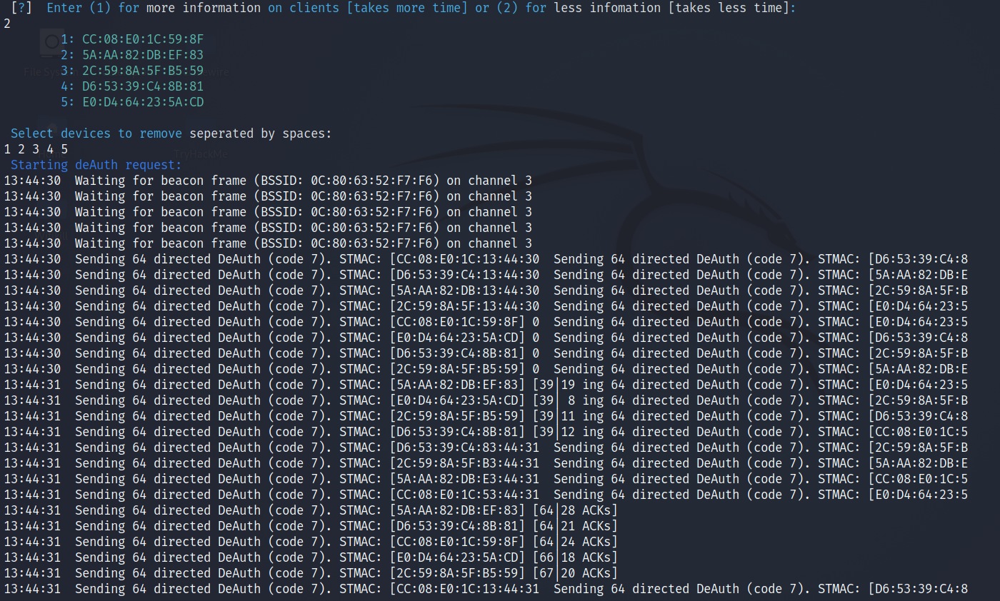
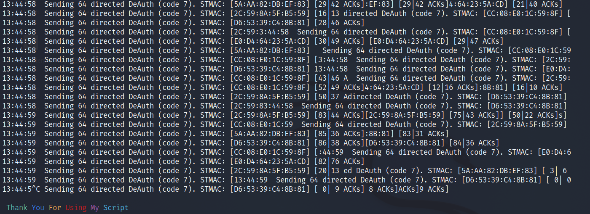

# Wifikill

> Python script that automates kicking people out of the network using aircrack-ng suite. Can be used to control the clients on a network.

## Prerequisites

```
* Tested on Python 3.9
* Tested on Kali Linux
* Network card that can be put in monitor mode
* Aircrack-ng
* Root privileges.
```

## Overview
This scripts consists of scanning for nearby networks, selecting the network we want to attack, selecting which users to kick or to allow to stay connected, then continuously sending DeAuth packets to the victims. 

## Run
```
$ git clone https://github.com/KevinZiadeh/Wifikill.git
$ cd Wifikill
$ python wifikill.py
```




